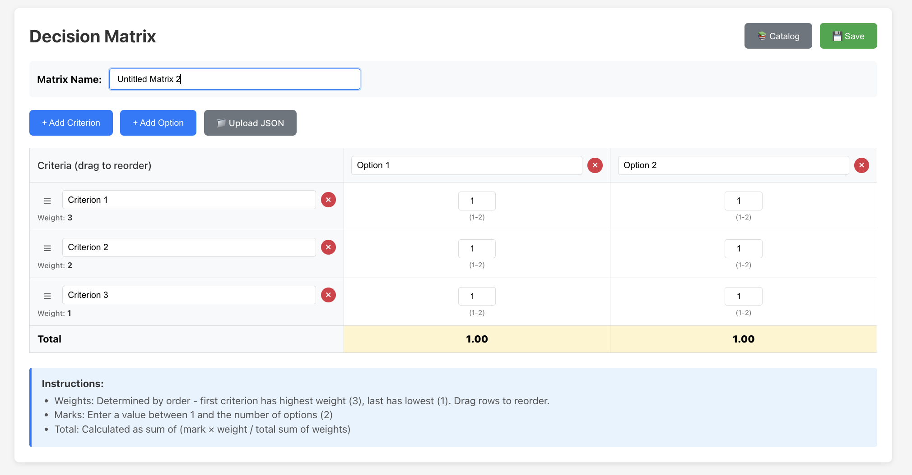

# Decision Matrix

A web application for creating and managing decision matrices to help evaluate options against multiple criteria.

## Overview

Create decision matrices by defining criteria and options, then assign marks to evaluate each option. The app automatically calculates weighted totals based on criterion order (first criterion has highest weight). Features include drag-and-drop reordering, save/load functionality, and JSON export/import.



## Installation

```bash
cd ui
npm install
npm run dev
```

The app will be available at `http://localhost:5173`

## Tech Stack

- **React** 18.2.0
- **Vite** 5.0.0
- **React DOM** 18.2.0
